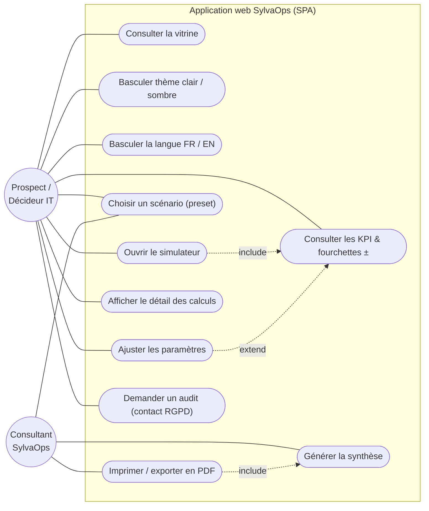
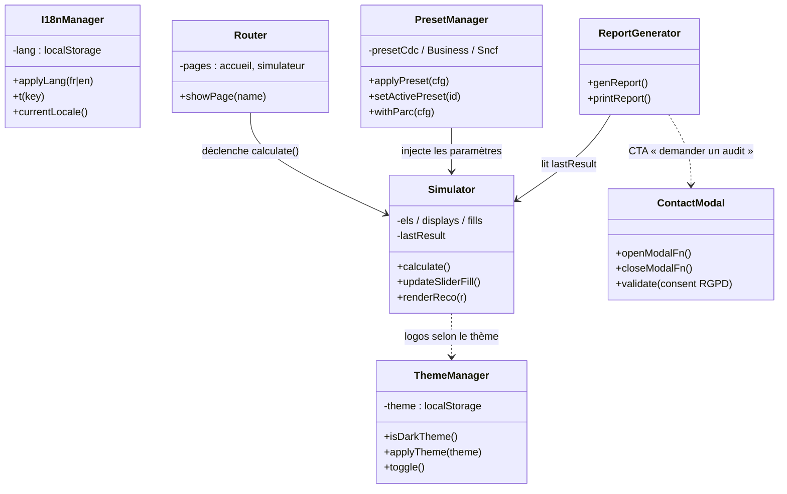
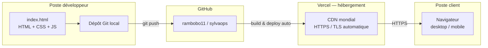

# Diagrammes UML — Application web SylvaOps

Projet M1 MCSI · Démonstrateur FinOps & Green IT
Modélisation de la solution web (SPA `index.html` — HTML/CSS/JS, sans framework).

> Note de lecture : l'application étant une **Single-Page Application** 100 % côté client, les diagrammes décrivent des **modules JavaScript** (et non des classes objet classiques) ainsi que les interactions utilisateur → interface → moteur de calcul.

---

## 1. Diagramme de cas d'utilisation

Décrit **qui** fait **quoi** avec l'application.



**Acteurs**
- **Prospect / Décideur IT** : explore la vitrine et simule ses économies de façon autonome.
- **Consultant SylvaOps** : utilise l'outil en avant-vente, choisit un scénario, génère et imprime la synthèse.

**Relations UML**
- `include` : ouvrir le simulateur **inclut** l'affichage des KPI ; imprimer **inclut** la génération de la synthèse.
- `extend` : ajuster un paramètre **étend** l'affichage des KPI (recalcul temps réel optionnel).

---

## 2. Diagramme de séquence — simulation en temps réel

Décrit le **déroulé d'un calcul** quand l'utilisateur agit sur un paramètre ou un preset.

```mermaid
sequenceDiagram
  actor U as Utilisateur
  participant UI as Interface<br/>(sliders / selects)
  participant SIM as calculate()
  participant ENG as Moteur de calcul<br/>(FinOps + Green IT)
  participant DOM as KPI &amp; Recommandations

  U->>UI: Modifie un paramètre / choisit un preset
  UI->>SIM: événement input / change
  SIM->>SIM: Lecture des valeurs (objet els)
  SIM->>ENG: Décomposition budget + application des leviers
  Note over ENG: Extinction, rightsizing,<br/>stockage, logs, parc matériel
  ENG-->>SIM: Économie €, kWh, CO₂, ROI, VAN
  SIM->>SIM: Calcul des fourchettes d'incertitude ±
  SIM->>DOM: requestAnimationFrame → animation des KPI
  SIM->>DOM: renderReco() → recommandations dynamiques
  DOM-->>U: Affichage mis à jour instantanément
```

**Points clés**
- Aucun aller-retour réseau : tout le calcul est **local** (réactivité immédiate, aucune donnée envoyée).
- `requestAnimationFrame` assure une **animation fluide** des chiffres.
- Les **fourchettes ±** traduisent l'incertitude assumée du modèle.

---

## 3. Diagramme de composants (modules JavaScript)

Décrit l'**organisation logique interne** de l'application.



**Rôle de chaque module**
- **ThemeManager** : mode clair/sombre persistant (`localStorage`).
- **I18nManager** : bascule FR/EN, traduction vitrine + simulateur + synthèse, formatage locale.
- **Router** : navigation SPA entre la vitrine et le simulateur.
- **Simulator** : cœur du produit — lecture des paramètres, calcul, affichage des KPI et recommandations.
- **PresetManager** : scénarios pré-remplis (CDC, business, SNCF).
- **ReportGenerator** : synthèse imprimable / export PDF.
- **ContactModal** : formulaire d'audit avec consentement RGPD.

---

## 4. Diagramme de déploiement

Décrit la **chaîne de publication** et l'exécution de l'application.



**Points clés**
- **Statique** : aucun serveur applicatif ni base de données → surface d'attaque minimale.
- **Déploiement continu** : chaque `git push` redéploie automatiquement sur Vercel.
- **HTTPS/TLS** géré par la plateforme, sans configuration.

---

## Cohérence avec la solution

Ces diagrammes reflètent fidèlement le code réel (`index.html`) : navigation SPA (`showPage`), moteur `calculate()`, presets (`applyPreset`), synthèse (`genReport` / `printReport`), thème (`applyTheme`) et modale de contact avec consentement RGPD. Ils sont compatibles avec l'architecture décrite dans le rapport (sections Solution & Architecture).
