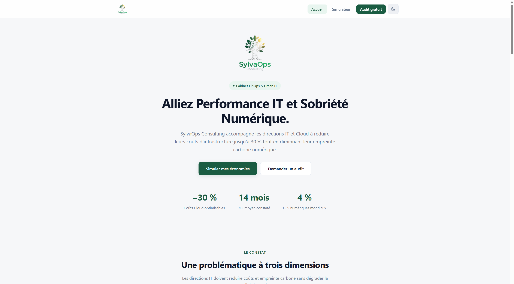
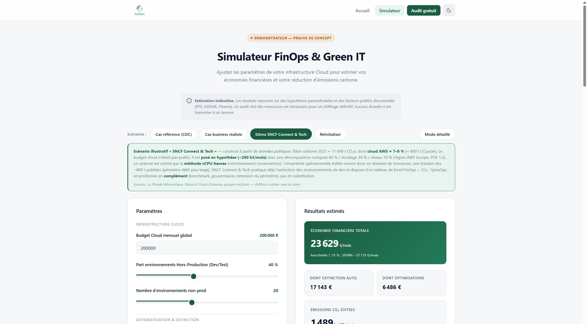
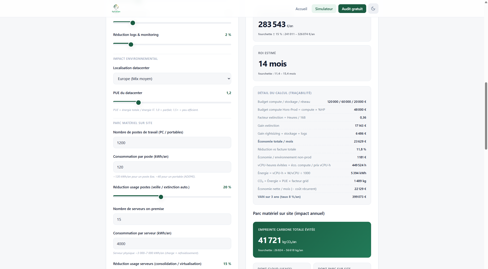

# 11. SOLUTION PROPOSÉE

La solution proposée par SylvaOps Consulting vise à accompagner les organisations dans l'identification, l'évaluation et la priorisation des opportunités d'optimisation de leurs infrastructures cloud, en conciliant maîtrise des coûts, performance opérationnelle et réduction de l'empreinte environnementale.

## 11.1. Vue d'ensemble de la solution

Afin de répondre aux besoins identifiés, la solution s'appuie sur deux niveaux complémentaires :

| Niveau | Rôle |
|--------|------|
| **Démonstrateur web** | Estimer et comparer des scénarios d'optimisation à partir de paramètres représentatifs, sans accès aux infrastructures du client. |
| **Mission d'audit** | Approfondir l'analyse à partir des données réelles de l'environnement cloud et produire un rapport de restitution avec recommandations priorisées. |

Le démonstrateur accessible en ligne combine une vitrine présentant le cabinet et sa méthode, et un simulateur interactif FinOps & Green IT. L'utilisateur renseigne les caractéristiques de son infrastructure — budget, part hors-production, leviers d'optimisation, contexte environnemental, parc matériel — et obtient en temps réel une estimation des économies financières, des gains énergétiques, des émissions de CO₂ évitées, du retour sur investissement et de la valeur actuelle nette. Les résultats sont restitués sous forme de tableau de bord, de recommandations et de synthèse décisionnelle exportable.

Lorsque la simulation met en évidence un potentiel d'optimisation, l'organisation peut solliciter un accompagnement via un formulaire de contact. Les consultants analysent alors l'environnement réel du client, confirment les gisements identifiés et formalisent un plan d'actions. La solution fait ainsi progresser l'analyse du déclaratif vers le mesuré.

## 11.2. La démarche GreenOps

La solution s'inscrit dans une démarche **GreenOps**, qui associe les leviers d'optimisation financière du **FinOps** (*Financial Operations*) aux objectifs environnementaux du **Green IT**.

Dans le cloud, le gaspillage financier et le gaspillage énergétique sont deux facettes d'un même problème : une ressource inutilement allumée génère à la fois un coût d'exploitation et des émissions de gaz à effet de serre. SylvaOps unifie ces deux dimensions dans une démarche opérationnelle unique, afin d'améliorer simultanément la maîtrise des coûts, la performance opérationnelle et la réduction de l'empreinte environnementale des infrastructures cloud.

## 11.3. Les leviers d'optimisation retenus

La solution mobilise des leviers concrets, compatibles avec les exigences de disponibilité et de continuité de service :

| Levier | Principe | Impact attendu |
|--------|----------|----------------|
| **Extinction planifiée du hors-production** | Arrêt des environnements de développement, test et recette hors plages d'usage. | Économie proportionnelle au temps d'extinction ; baisse de la consommation énergétique. |
| **Rightsizing** | Redimensionnement des ressources surdimensionnées à leur usage réel. | Réduction du gaspillage de compute. |
| **Optimisation du stockage** | Politique de niveaux (*tiering*), nettoyage des données obsolètes. | Réduction du poste stockage. |
| **Rationalisation des logs et du monitoring** | Adaptation de la politique de rétention. | Réduction des coûts d'observabilité. |
| **Allongement de la durée de vie du matériel sur site** | Prolongation de l'usage des postes et serveurs locaux. | Réduction du carbone de fabrication annualisé. |

La production n'est jamais impactée : l'extinction ne concerne que le hors-production et chaque action reste réversible.

## 11.4. Interface du démonstrateur web

Le démonstrateur se présente sous la forme d'une application web unique, organisée en deux espaces accessibles sans rechargement de page.

La **vitrine commerciale** expose la problématique FinOps & Green IT, les indicateurs clés et les appels à l'action vers le simulateur.

*Figure 11.1 — Page d'accueil : accroche, indicateurs clés et accès au simulateur.*

Le **simulateur interactif** est structuré en deux colonnes : les paramètres à gauche, les résultats en temps réel à droite. Des préréglages permettent de charger des scénarios types, dont un cas illustratif SNCF Connect & Tech.

*Figure 11.2 — Paramètres d'entrée et indicateurs de sortie (préréglage SNCF Connect & Tech).*

L'interface affiche le détail de calcul étape par étape, les recommandations dynamiques, les fourchettes d'incertitude et une synthèse décisionnelle exportable.

*Figure 11.3 — Traçabilité des calculs et empreinte carbone totale évitée (cloud et parc matériel).*

## 11.5. La méthode d'accompagnement en quatre étapes

La démarche de mission proposée par SylvaOps se déroule de façon progressive :

1. **Audit et cartographie** — Inventaire des ressources, identification des gisements d'économies et de sobriété.
2. **Optimisation** — Mise en œuvre des premiers gains rapides : rightsizing, nettoyage de stockage, calibrage des environnements hors-production.
3. **Automatisation** — Industrialisation des leviers retenus : extinction planifiée, règles d'arrêt automatique.
4. **Gouvernance** — Pilotage dans la durée via des indicateurs économiques et environnementaux, ancrage des bonnes pratiques et alimentation du reporting extra-financier (Loi REEN, directive CSRD).

## 11.6. Transparence et positionnement

SylvaOps assume une posture de crédibilité : les résultats du simulateur sont des estimations paramétrables, et non des mesures certifiées. Chaque indicateur est décomposable étape par étape ; les constantes utilisées (facteurs d'émission, PUE, coefficients énergétiques) s'appuient sur des sources reconnues (RTE/ADEME, Uptime Institute, Cloud Carbon Footprint, Boavizta, Flexera). Les KPI sont présentés en fourchettes (± %) plutôt qu'en chiffres uniques. Les calculs s'exécutent localement dans le navigateur, sans transmission des paramètres d'infrastructure vers un serveur distant.

Le détail des formules de calcul est présenté en annexe.

**Positionnement vis-à-vis de SNCF Connect & Tech.** L'organisation dispose déjà d'une infrastructure cloud mature sur AWS, d'une démarche de numérique responsable reconnue (label Numérique Responsable niveau 2) et de pratiques d'extinction avancées sur les environnements hors-production. SylvaOps se positionne en complément : consolidation de la gouvernance FinOps / Green IT, extension du périmètre d'optimisation (stockage, observabilité, matériel sur site) et structuration du reporting environnemental.
